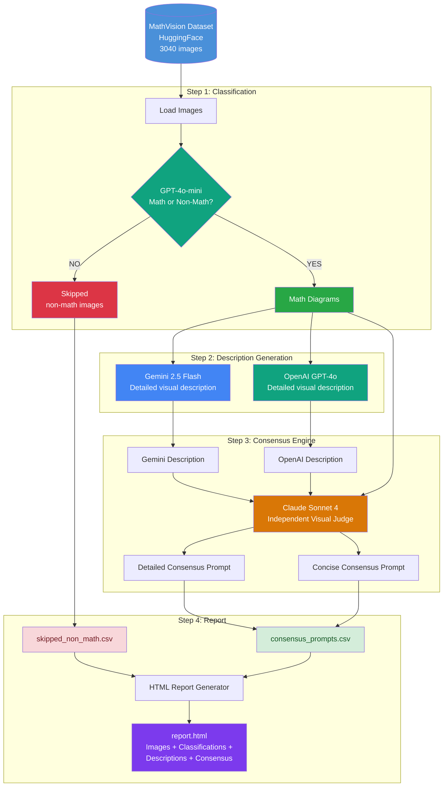

# mathvdiagram

A benchmark for evaluating the capabilities of LLMs in precision math diagram generation.

## Pipeline Overview

The benchmarking pipeline processes the [MathVision](https://huggingface.co/datasets/MathLLMs/MathVision) dataset through 4 steps:

1. **Classify** — GPT-4o-mini classifies each image as math-diagram or non-math
2. **Describe** — Gemini and OpenAI GPT-4o generate detailed visual descriptions of math images
3. **Consensus** — Claude acts as an independent visual judge, reviewing the image + both descriptions to produce a final consensus prompt (detailed + concise)
4. **Report** — Generates an HTML report with embedded images, classifications, descriptions, and consensus results



## Project Structure

```
mathvdiagram/
    __init__.py          # Package metadata
    config.py            # Configuration (API keys, model names, prompts)
    api_clients.py       # Factory functions for OpenAI, Gemini, Claude clients
    data_loader.py       # Loads MathVision dataset from HuggingFace
    utils.py             # Retry logic, base64 encoding, checkpoint helpers
    classify.py          # Step 1: Math vs non-math classification
    describe.py          # Step 2: Gemini + OpenAI descriptions
    consensus.py         # Step 3: Claude consensus engine
    report.py            # Step 4: HTML report generation
    pipeline.py          # Orchestrator that runs all steps
    benchmarking_qwen.ipynb  # Original reference notebook
```

## Setup

### 1. Create and activate virtual environment

```bash
cd mathvdiagram
python -m venv diagramb-env

# Windows (PowerShell)
diagramb-env\Scripts\activate

# Windows (Git Bash / WSL)
source diagramb-env/Scripts/activate

# macOS / Linux
source diagramb-env/bin/activate
```

### 2. Install dependencies

```bash
pip install -r requirements.txt
```

### 3. Configure API keys

Copy the example env file and fill in your API keys:

```bash
cp .env.example .env
```

Required keys in `.env`:

```
GOOGLE_API_KEY=your-google-api-key
OPENAI_API_KEY=your-openai-api-key
ANTHROPIC_API_KEY=your-anthropic-api-key
```

## Usage

All commands are run from the project root (`mathvdiagram/`).

### Run the full pipeline (all 3040 images)

```bash
python -m mathvdiagram.pipeline
```

### Run on a subset for testing

```bash
# First 10 images
python -m mathvdiagram.pipeline --num-samples 10

# Specific image IDs
python -m mathvdiagram.pipeline --test-ids 1 5 8 2121
```

### Skip completed steps

```bash
# Skip classification if already done
python -m mathvdiagram.pipeline --skip-classify

# Skip both classification and descriptions
python -m mathvdiagram.pipeline --skip-classify --skip-describe
```

### Start fresh (no resume)

```bash
python -m mathvdiagram.pipeline --no-resume
```

### Generate only the HTML report (from existing CSVs)

```bash
python -m mathvdiagram.report
```

### Adjust API rate limiting

```bash
# 5 second delay between API calls
python -m mathvdiagram.pipeline --delay 5
```

## Output

All outputs are saved to the `output/` directory:

| File | Description |
|------|-------------|
| `classification_results.csv` | Images classified as math diagrams |
| `skipped_non_math.csv` | Images classified as non-math (skipped) |
| `descriptions.csv` | Gemini + OpenAI descriptions for math images |
| `consensus_prompts.csv` | Claude consensus (detailed + concise prompts) |
| `report.html` | Visual HTML report with embedded images and all results |

## Configuration

Additional settings can be overridden via environment variables or `.env`:

| Variable | Default | Description |
|----------|---------|-------------|
| `HF_DATASET_NAME` | `MathLLMs/MathVision` | HuggingFace dataset |
| `HF_SPLIT` | `test` | Dataset split to use |
| `OUTPUT_DIR` | `output` | Output directory |
| `GEMINI_MODEL` | `gemini-2.5-flash` | Gemini model name |
| `CLAUDE_MODEL` | `claude-sonnet-4-20250514` | Claude model name |
| `DELAY_BETWEEN_REQUESTS` | `3` | Seconds between API calls |
| `CHECKPOINT_EVERY` | `10` | Save checkpoint every N images |
| `MAX_RETRIES` | `5` | Max retries for failed API calls |
