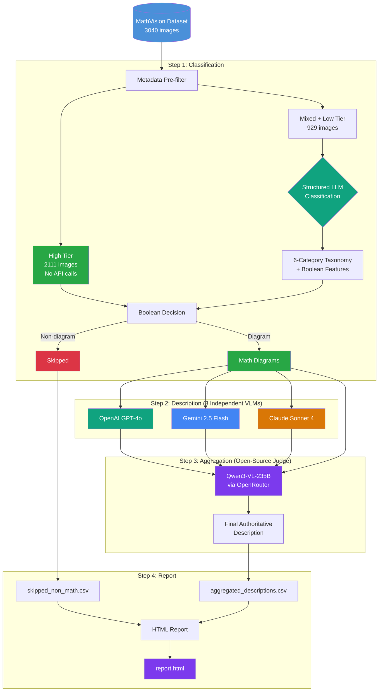

# MathVDiagram

A benchmark for evaluating LLMs on precision mathematical diagram generation.

MathVDiagram processes the [MathVision](https://huggingface.co/datasets/MathLLMs/MathVision) dataset (2920 images across 16 math subjects) through a multi-stage pipeline: classify images into a 6-category diagram taxonomy, generate structured visual descriptions from 3 independent proprietary VLMs, and aggregate them into a single authoritative description using an open-source VLM judge.

## Why This Architecture

### The Problem

Benchmarking diagram generation requires precise visual descriptions — detailed enough for a model to recreate the diagram exactly. A single VLM produces descriptions with blind spots: it might capture geometric labels perfectly but miss line styles, or describe axes accurately but overlook subtle angle marks.

### The Solution: Diverse Encoders + Independent Judge

**Step 2 (Description)** uses an ensemble of popular VLMs with different vision encoders:

| Model | 
|-------|
| **OpenAI GPT-4o** |
| **Gemini 2.5 Flash** | 
| **Claude Sonnet 4** |
| **llama 3.2** |

Qwen was included but due to large latency in its APIs, first run has excluded it. However, the benchmark can accomodate any VLMs.

Each model independently describes the same image using a structured 12-point checklist. This means 3 independent attempts to capture every visual detail — vertex labels, angle marks, line styles, shading, spatial relationships.

**Step 3 (Aggregation)** uses **llama** (open-source, via OpenRouter) as the judge:
- Sees the **original image** plus all 3 descriptions
- Identifies what they **agree** on (high confidence)
- **Resolves conflicts** by checking the image directly
- Adds anything all 3 **missed**

Why Qwen? It's open-source (Apache 2.0), so the aggregation step is fully reproducible. It's also not a participant in Step 2, avoiding circularity — the judge never grades its own work.

### No Classfication of Images 

We make no assumptions on ability of LLMs to be able to reproduce these 3040 diagrams. Many are photographs, illustrations, or decorated puzzles. We do understand that amongst the images such as illustrations of math diagrams coupled with figurines or natural objects. Since many text-to-image models are getting better, the challenge is to reproduce these images with mathematical correctness rather than exact figures shown here. The types of images are:

- **High-tier subjects** (e.g., analytic geometry, solid geometry): Majority pure math diagrams.
- **Mixed-tier subjects** (e.g., algebra, graph theory): contain both diagrams and illustrations
- **Low-tier subjects** (e.g., counting, arithmetic): mostly illustrated content

## Pipeline Overview

```
Step 1: Classification (dataset_helper/) 
  MathVision (3040 images)
    → Metadata pre-filter (2111 high-tier → no API calls)
    → Structured LLM classification (929 mixed/low-tier images)
    → Boolean-based diagram/non-diagram decision
    → Output: full_classification.csv

Step 2: Description (describe.py)
    → OpenAI GPT-4o    → description_openai
    → Gemini 2.5 Flash → description_gemini
    → Claude Sonnet 4  → description_claude
  Same 12-point checklist prompt + category-specific hints
    → Output: descriptions.csv

Step 3: Aggregation (consensus.py)
  Each image + all 3 descriptions
    → Qwen3-VL-235B (via OpenRouter)
    → Agreement analysis, conflict resolution, coverage check
    → Output: aggregated_descriptions.csv

Step 4: Report (report.py)
    → HTML report with embedded images, descriptions, and aggregated results
    → Output: report.html
```



## Diagram Taxonomy

Images are classified into 6 categories, each with specific description focus areas:

| Category | Definition | Examples |
|----------|-----------|----------|
| **Geometric Construction** | Abstract 2D shapes with formal math annotations — labeled vertices, angle marks, congruence ticks | Labeled triangles, circle theorems, polygon constructions |
| **Coordinate Plot** | Images with explicit coordinate systems and axes — plotted functions, data points, defined regions | Cartesian planes with functions, polar plots, shaded regions |
| **Statistical Chart** | Charts presenting quantitative data with labeled axes or categories | Bar charts, pie charts, histograms, scatter plots |
| **Schematic Diagram** | Formally structured diagrams showing mathematical relationships without coordinate axes | Venn diagrams, number lines, tree diagrams, labeled graphs |
| **3D Figure** | Wireframe or technical drawings of 3D mathematical objects with annotations | Labeled cubes/prisms/pyramids, cross-sections, nets of solids |
| **Non-Diagram** | Images relying on real-world objects, photographs, or illustrations | Animal counting, illustrated puzzles, clock faces |

The category determines which **hints** are appended to the description prompt. For example, a `geometric_construction` image gets: *"FOCUS ESPECIALLY ON: exact vertex labels, angle measures, congruence/parallel marks, right-angle indicators..."*

## Project Structure

```
mathvdiagram/
├── __init__.py              # Package init, re-exports dataset_helper
├── config.py                # API keys, model names, prompts, output paths
├── api_clients.py           # Client factories: OpenAI, Gemini, Claude, Qwen (OpenRouter)
├── data_loader.py           # HuggingFace dataset loading with image caching
├── utils.py                 # Retry logic, base64 encoding, checkpoint I/O
├── classify.py              # Legacy GPT binary classification (fallback)
├── describe.py              # Step 2: 3-provider description generation
├── consensus.py             # Step 3: Qwen VL aggregation
├── report.py                # Step 4: HTML report generation
├── pipeline.py              # Main orchestrator (Steps 1–4)
│
└── dataset_helper/          # Step 1: Classification subsystem
    ├── __init__.py           # Public API exports
    ├── __main__.py           # CLI: python -m mathvdiagram.dataset_helper
    ├── taxonomy.py           # 6-category taxonomy definitions + subject-priority mapping
    ├── exploration.py        # Dataset statistics, sampling, metadata pre-filter
    ├── classification.py     # Structured LLM classification (multi-provider)
    ├── agreement.py          # Multi-model agreement, boolean rules, reliability scoring
    ├── validation.py         # Quality signals, description-based validation, ablation
    ├── pipeline.py           # Classification pipeline orchestrator
    └── report.py             # Standalone HTML classification report
```

### File Details

#### Core Pipeline

| File | Purpose |
|------|---------|
| **`config.py`** | Central configuration. API keys loaded from `.env`, model names (`gpt-5.2`, `gemini-2.5-flash`, `claude-sonnet-4`, `qwen3-vl-235b`), output CSV paths, the 12-point description checklist prompt, category-specific hints, and pipeline defaults (delay, checkpoint interval, retry count). |
| **`api_clients.py`** | Factory functions that create authenticated API clients. `get_openai_client()`, `get_gemini_model()`, `get_claude_client()` for proprietary providers, plus `get_qwen_client()` which wraps OpenRouter's OpenAI-compatible endpoint. |
| **`data_loader.py`** | Loads MathVision from HuggingFace into a pandas DataFrame with a global cache. Provides `get_image_pil()`, `get_image_base64()`, and `get_image_bytes()` — images are stored separately from the DataFrame to avoid serialization overhead. |
| **`utils.py`** | Shared utilities. `call_with_retry()` implements exponential backoff with smart error classification (quota exhaustion vs rate limits vs timeouts). `load_checkpoint()` / `save_checkpoint()` enable resume across all pipeline stages. |
| **`describe.py`** | Step 2. Sends each math image to OpenAI, Gemini, and Claude independently using the same 12-point checklist prompt. `_build_description_prompt(category)` appends category-specific hints. Each provider call is isolated — if one fails, the others still produce descriptions. Outputs `description_openai`, `description_gemini`, `description_claude` columns. |
| **`consensus.py`** | Step 3. Sends the original image plus all available descriptions to Qwen3-VL-235B via OpenRouter. The model follows a structured process: agreement analysis → conflict resolution → coverage check → final description. Output is parsed into `agreement`, `conflicts`, `additions`, and `final_description` fields. Backward-compatible with old column names (`openai_prompt`, `gemini_prompt`). |
| **`report.py`** | Step 4. Builds a standalone HTML report with embedded base64 images. Shows classification badges (category + reliability), description boxes for each provider (Gemini/OpenAI/Claude with color-coded headers), and the Qwen aggregated description. Supports both old and new column naming conventions. |
| **`pipeline.py`** | Main orchestrator. Runs Steps 1→2→3→4 in sequence with skip flags (`--skip-classify`, `--skip-describe`, `--skip-aggregate`). Includes `_generate_legacy_csvs()` which bridges taxonomy classification output to the column format expected by downstream steps. |
| **`classify.py`** | Legacy fallback. Simple binary (math/non-math) classification using GPT. Activated with `--legacy-classify`. Not used in the default taxonomy pipeline. |

#### Classification Subsystem (`dataset_helper/`)

| File | Purpose |
|------|---------|
| **`taxonomy.py`** | Defines the 6-category taxonomy as `TaxonomyCategory` dataclasses with definitions, include/exclude examples, and keywords. Maps all 16 MathVision subjects to priority tiers (high/mixed/low) and default categories. |
| **`exploration.py`** | Dataset analysis. `get_dataset_statistics()` computes distributions. `apply_metadata_prefilter()` splits images by subject priority — high-tier subjects skip LLM classification entirely. Prints tier breakdown and API call savings. |
| **`classification.py`** | Structured LLM classification. Sends images with a taxonomy-aware prompt that extracts 6 boolean features (`has_geometric_labels`, `has_labeled_axes`, `has_grid_or_coordinate_system`, `has_mathematical_notation`, `has_real_world_objects`, `has_photographic_content`) plus category, confidence, and reasoning. Supports OpenAI, Gemini, and Claude backends. |
| **`agreement.py`** | Multi-model consensus. `classify_from_booleans()` applies 5 deterministic rules over majority-voted boolean features to make diagram/non-diagram decisions — immune to LLM confidence calibration issues. `compute_reliability_score()` combines agreement level with mean confidence. `compute_agreement_statistics()` tracks boolean decision distributions and override rates. |
| **`validation.py`** | Quality assurance. `detect_quality_signals()` scans descriptions for non-diagram phrases with negation awareness. `run_filter_ablation()` proves the filter adds value by comparing independent metrics between included and excluded images. |
| **`pipeline.py`** | Classification orchestrator. Runs the full 8-step flow: load dataset → print summary → metadata pre-filter → validate pre-filter sample → structured LLM classification → compute agreement → save results → generate statistics. |
| **`report.py`** | Standalone HTML classification report with category-colored badges, reliability bars, provider vote chips, and JavaScript filter buttons. Run independently via `python -m mathvdiagram.dataset_helper --report`. |

## Setup

### 1. Create and activate virtual environment

```bash
cd mathvdiagram
python -m venv diagramb-env

# Windows (PowerShell)
diagramb-env\Scripts\activate

# Windows (Git Bash / WSL)
source diagramb-env/Scripts/activate

# macOS / Linux
source diagramb-env/bin/activate
```

### 2. Install dependencies

```bash
pip install -r requirements.txt
```

### 3. Configure API keys

```bash
cp .env.example .env
```

Required keys in `.env`:

```env
# Proprietary VLMs (Steps 1 & 2)
GOOGLE_API_KEY=your-google-api-key
OPENAI_API_KEY=your-openai-api-key
ANTHROPIC_API_KEY=your-anthropic-api-key

# Open-source aggregator (Step 3)
OPENROUTER_API_KEY=your-openrouter-api-key
```

## Usage

All commands are run from the project root (`mathvdiagram/`).

### Run the full pipeline

```bash
python -m mathvdiagram.pipeline
```

### Test on a small subset

```bash
# Classify 10 images, then describe + aggregate the math ones
python -m mathvdiagram.pipeline --num-samples 10

# Specific image IDs only
python -m mathvdiagram.pipeline --test-ids 1 5 8 2121
```

### Skip completed steps

```bash
# Reuse existing classification, run descriptions + aggregation
python -m mathvdiagram.pipeline --skip-classify

# Reuse classification + descriptions, run aggregation only
python -m mathvdiagram.pipeline --skip-classify --skip-describe

# Reuse everything, regenerate the HTML report only
python -m mathvdiagram.pipeline --skip-classify --skip-describe --skip-aggregate
```

### Start fresh (ignore checkpoints)

```bash
python -m mathvdiagram.pipeline --no-resume
```

### Run classification independently

```bash
# Full classification with statistics
python -m mathvdiagram.dataset_helper --classify

# Classification + standalone HTML report
python -m mathvdiagram.dataset_helper --classify --report

# Just the report (from existing CSV)
python -m mathvdiagram.dataset_helper --report

# Dataset exploration only
python -m mathvdiagram.dataset_helper --stats
```

### Use legacy classification

```bash
# Force old GPT binary classification instead of taxonomy
python -m mathvdiagram.pipeline --legacy-classify
```

### Adjust rate limiting

```bash
python -m mathvdiagram.pipeline --delay 5
```

## Output Files

All outputs are saved to the `output/` directory:

| File | Step | Description |
|------|------|-------------|
| `full_classification.csv` | 1 | Complete classification results for all 3,040 images — categories, boolean features, reliability scores, agreement levels |
| `classification_results.csv` | 1 | Math diagrams only (legacy bridge format with `is_math=True`) |
| `skipped_non_math.csv` | 1 | Non-diagram images (legacy bridge format with `is_math=False`) |
| `classification_report.html` | 1 | Interactive HTML report for classification results with category filters |
| `descriptions.csv` | 2 | 3 independent descriptions per image (`description_openai`, `description_gemini`, `description_claude`) |
| `aggregated_descriptions.csv` | 3 | Qwen aggregated output — `agreement`, `conflicts`, `additions`, `final_description` |
| `report.html` | 4 | Full pipeline HTML report with images, descriptions, and aggregated results |

## Configuration

Settings can be overridden via environment variables or `.env`:

| Variable | Default | Description |
|----------|---------|-------------|
| `OPENAI_API_KEY` | — | OpenAI API key (required for Steps 1 & 2) |
| `GOOGLE_API_KEY` | — | Google AI API key (required for Step 2) |
| `ANTHROPIC_API_KEY` | — | Anthropic API key (required for Step 2) |
| `OPENROUTER_API_KEY` | — | OpenRouter API key (required for Step 3) |
| `HF_DATASET_NAME` | `MathLLMs/MathVision` | HuggingFace dataset |
| `HF_SPLIT` | `test` | Dataset split |
| `OUTPUT_DIR` | `output` | Output directory |
| `GEMINI_MODEL` | `gemini-2.5-flash` | Gemini model for descriptions |
| `CLAUDE_MODEL` | `claude-sonnet-4-20250514` | Claude model (classification) |
| `CLAUDE_DESCRIPTION_MODEL` | `claude-sonnet-4-20250514` | Claude model (descriptions) |
| `QWEN_MODEL` | `qwen/qwen3-vl-235b-a22b-instruct` | Qwen VL model via OpenRouter |
| `DESCRIPTION_MAX_TOKENS` | `2000` | Max tokens for description output |
| `AGGREGATION_MAX_TOKENS` | `3000` | Max tokens for aggregation output |
| `DELAY_BETWEEN_REQUESTS` | `3` | Seconds between API calls |
| `CHECKPOINT_EVERY` | `10` | Save checkpoint every N images |
| `MAX_RETRIES` | `5` | Max retries for failed API calls |
| `CLASSIFICATION_MODE` | `taxonomy` | `taxonomy` (default) or `legacy` |

## Design Decisions

### Why boolean-based classification instead of confidence thresholds?

LLM confidence scores are poorly calibrated — a model saying "90% confident" doesn't reliably mean 90% accuracy. Instead, classification uses 6 concrete boolean features (`has_geometric_labels`, `has_real_world_objects`, etc.) and applies deterministic rules:

1. Real-world objects without math structure → non-diagram
2. Photographic content without math structure → non-diagram
3. Geometric labels OR labeled axes OR grid → diagram
4. Mathematical notation without real-world objects → diagram
5. No strong signals → fallback to model category

This makes the pipeline's decisions transparent and reproducible.

### Why ensemble describers + 1 judge instead of 1 model?

A single VLM will consistently miss certain details based on its vision encoder's biases. Three independent models with different architectures produce complementary descriptions. The judge can verify against the actual image to resolve disagreements, rather than just picking the majority answer.

### Why metadata pre-filtering?

Subjects like "analytic geometry" and "solid geometry" are >95% formal diagrams. Sending these to an LLM for classification wastes API calls. The metadata pre-filter assigns these directly, saving ~2,100 calls (69% of the dataset) with negligible accuracy loss, validated by spot-checking 5% of pre-filtered images.

### Why open-source for aggregation?

Using a proprietary model (e.g., Claude) as both a describer and the judge creates circularity — the judge would be biased toward its own descriptions. Qwen3-VL-235B or llama are open-source, ensuring the aggregation step is reproducible and so we use one or the other depending on which is in the input pipeline.

