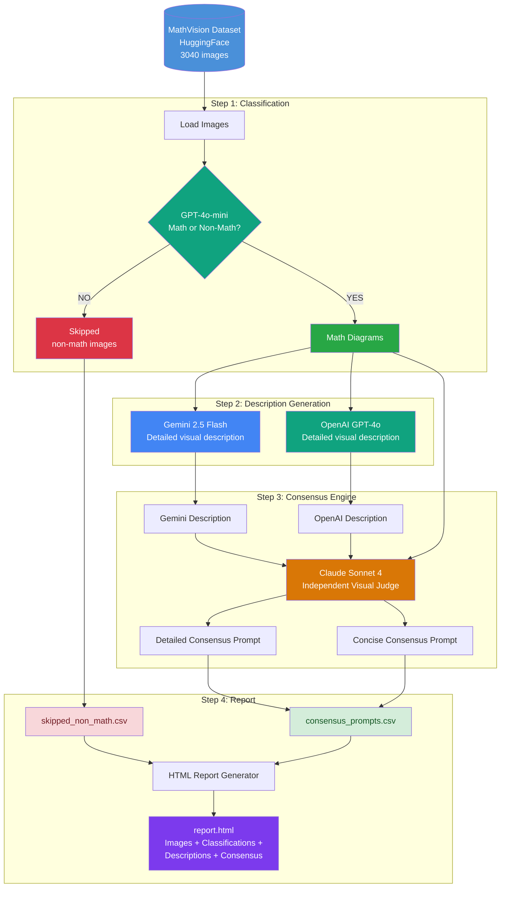

```mermaid
flowchart TD
    A[(MathVision Dataset<br/>HuggingFace<br/>3040 images)] --> B

    subgraph Step1["Step 1: Classification"]
        B[Load Images] --> C{GPT-4o-mini<br/>Math or Non-Math?}
        C -->|YES| D[Math Diagrams]
        C -->|NO| E[Skipped<br/>non-math images]
    end

    E --> F1[skipped_non_math.csv]

    subgraph Step2["Step 2: Description Generation"]
        D --> G[Gemini 2.5 Flash<br/>Detailed visual description]
        D --> H[OpenAI GPT-4o<br/>Detailed visual description]
    end

    G --> I[Gemini Description]
    H --> J[OpenAI Description]

    subgraph Step3["Step 3: Consensus Engine"]
        I --> K[Claude Sonnet 4<br/>Independent Visual Judge]
        J --> K
        D --> K
        K --> L[Detailed Consensus Prompt]
        K --> M[Concise Consensus Prompt]
    end

    L --> N[consensus_prompts.csv]
    M --> N

    subgraph Step4["Step 4: Report"]
        F1 --> O[HTML Report Generator]
        N --> O
        O --> P[report.html<br/>Images + Classifications +<br/>Descriptions + Consensus]
    end

    style A fill:#4a90d9,color:#fff
    style C fill:#10a37f,color:#fff
    style G fill:#4285f4,color:#fff
    style H fill:#10a37f,color:#fff
    style K fill:#d97706,color:#fff
    style P fill:#7c3aed,color:#fff
    style E fill:#dc3545,color:#fff
    style D fill:#28a745,color:#fff
    style F1 fill:#f8d7da,color:#721c24
    style N fill:#d4edda,color:#155724
```
